# 📱 Bài Tập Tuần 4 — Flutter UI & Dart Concurrency

Ứng dụng Flutter thực hiện năm bài tập: **List View**, **Grid View**, **Shared Preferences**, **Lập trình bất đồng bộ** và **Dart Isolates**.

---

## 📋 Mục Lục

- [Bài 1 — List View](#bài-1--list-view)
- [Bài 2 — Grid View](#bài-2--grid-view)
- [Bài 3 — Shared Preferences](#bài-3--shared-preferences)
- [Bài 4 — Lập Trình Bất Đồng Bộ](#bài-4--lập-trình-bất-đồng-bộ)
- [Bài 5 — Isolates](#bài-5--isolates)
- [Cấu Trúc Thư Mục](#cấu-trúc-thư-mục)

---

## Bài 1 — List View

Danh sách liên hệ có thể cuộn, xây dựng bằng `ListView.builder` với avatar placeholder màu sắc, thanh tìm kiếm lọc theo thời gian thực và trang chi tiết liên hệ.

**Tính năng đã thực hiện:**
- Hiển thị 12 liên hệ, mỗi liên hệ có avatar tròn màu placeholder
- Thanh tìm kiếm lọc theo tên, số điện thoại hoặc email ngay khi gõ
- Số lượng liên hệ cập nhật động theo kết quả tìm kiếm
- Nhấn vào một liên hệ để mở trang chi tiết với nút **Call** và **Message**

### Ảnh minh hoạ

| Danh sách đầy đủ | Cuộn danh sách |
|:---:|:---:|
| 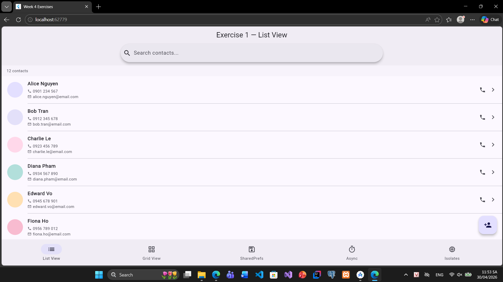 | 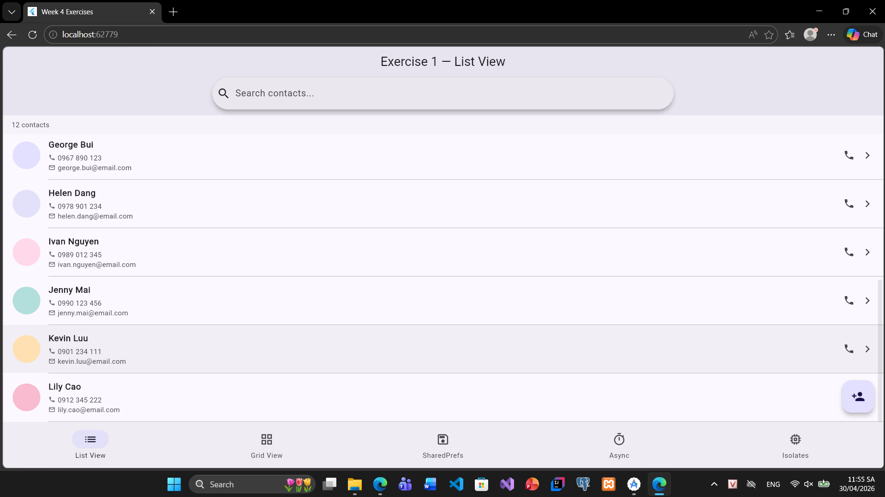 |
| *12 liên hệ hiển thị với avatar, số điện thoại và email* | *Danh sách cuộn mượt — có thể truy cập toàn bộ liên hệ* |

| Tìm kiếm | Chi tiết liên hệ |
|:---:|:---:|
| 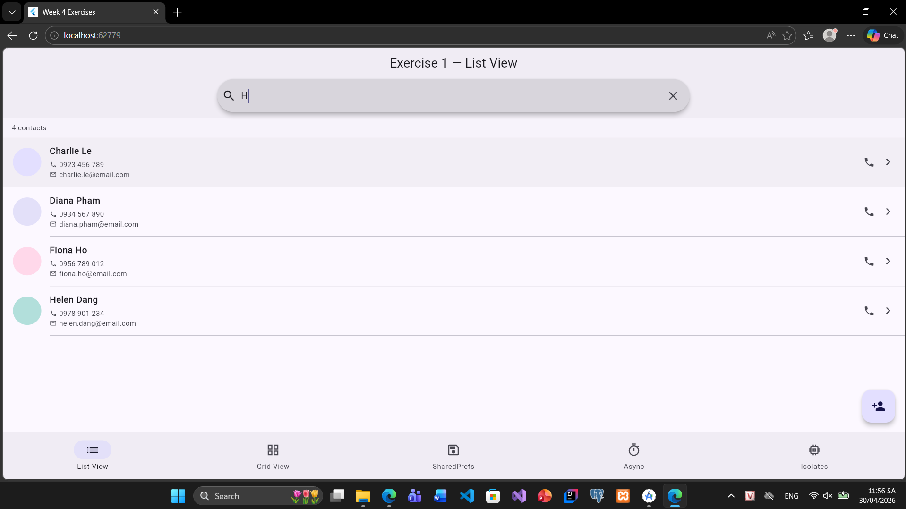 | 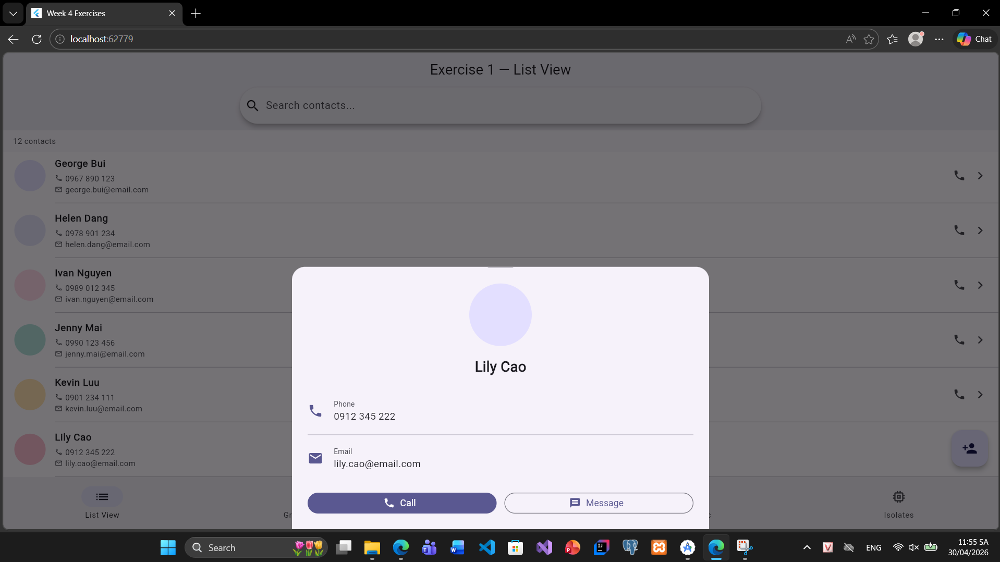 |
| *Gõ ký tự lọc danh sách ngay lập tức, số lượng cập nhật theo* | *Nhấn vào liên hệ mở trang chi tiết với đầy đủ thông tin, nút Call và Message* |

---

## Bài 2 — Grid View

Màn hình gallery hiển thị 12 item dùng hai loại `GridView` khác nhau.

**Section 1 — `GridView.count()`**
- `crossAxisCount: 3` · `mainAxisSpacing: 8` · `crossAxisSpacing: 8` · `childAspectRatio: 1.0`
- Tiêu đề: **"Fixed Column Grid"**

**Section 2 — `GridView.extent()`**
- `maxCrossAxisExtent: 150` · `mainAxisSpacing: 10` · `crossAxisSpacing: 10` · `childAspectRatio: 0.8`
- Tiêu đề: **"Responsive Grid"**

Mỗi item là một container màu có góc bo tròn, icon căn giữa và nhãn chữ bên dưới.

### Ảnh minh hoạ

| Fixed Column Grid | Responsive Grid |
|:---:|:---:|
| 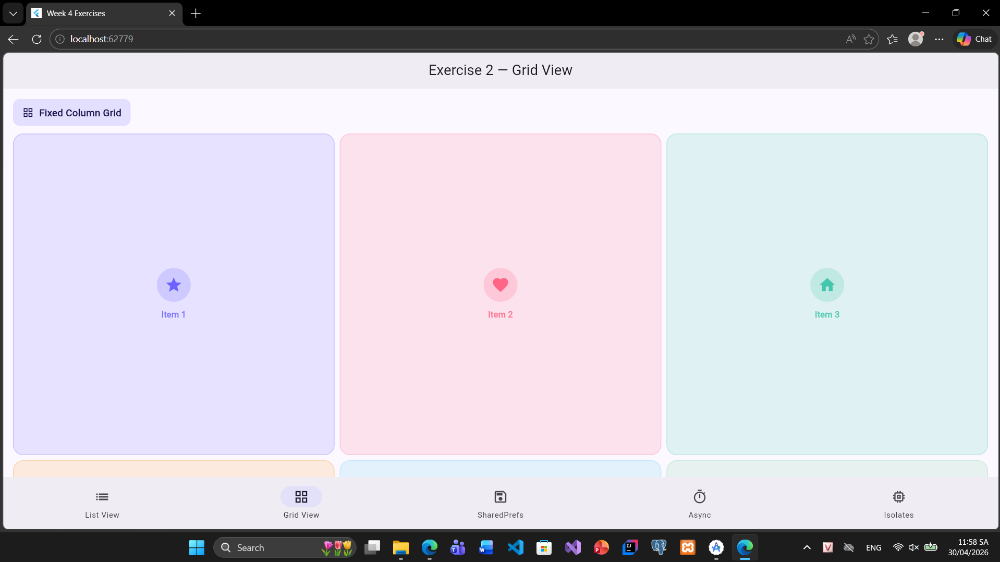 | 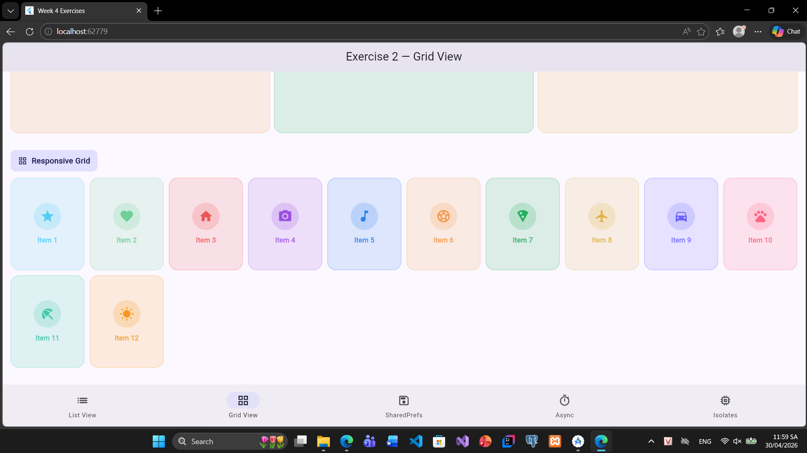 |
| *`GridView.count` — 3 cột cố định, không đổi theo kích thước màn hình* | *`GridView.extent` — số cột tự động điều chỉnh theo chiều rộng màn hình* |

| Cả hai section trên một màn hình |
|:---:|
| 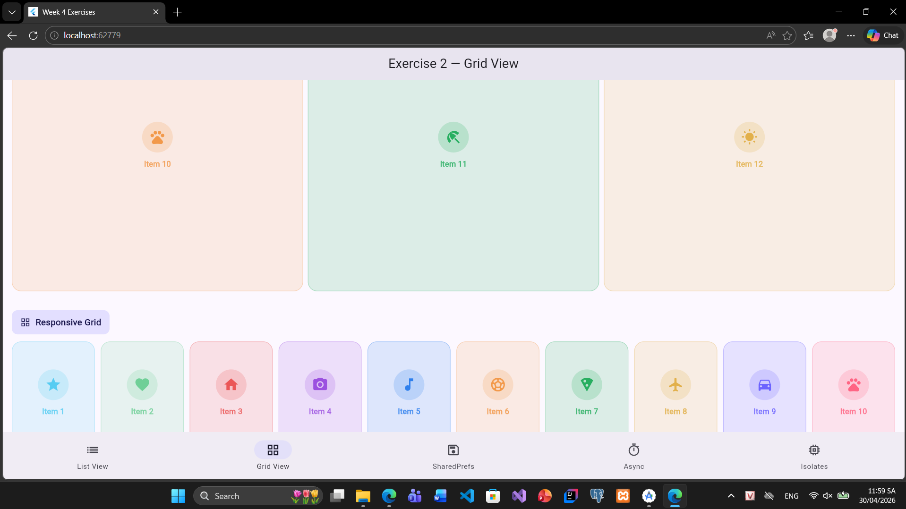 |
| *Màn hình cuộn đầy đủ: Fixed Column Grid phía trên, Responsive Grid phía dưới* |

---

## Bài 3 — Shared Preferences

Lưu trữ dữ liệu người dùng qua các phiên làm việc bằng package `shared_preferences`.

**Tính năng chính:**
- `TextField` để nhập tên
- Nút **Save Name** — lưu dữ liệu bằng `SharedPreferences.setString()`
- Nút **Show Name** — đọc và hiển thị dữ liệu đã lưu
- Thông báo phù hợp khi chưa có dữ liệu nào được lưu

**Bonus đã thực hiện ✅**
- Nút **Clear** — xoá toàn bộ dữ liệu đã lưu
- Lưu thêm các trường: **age** (tuổi) và **email**
- Toast thông báo thành công sau mỗi lần lưu

### Ảnh minh hoạ

**Luồng chính**

| Màn hình trống | Lưu tên + Toast | Hiển thị tên đã lưu |
|:---:|:---:|:---:|
| 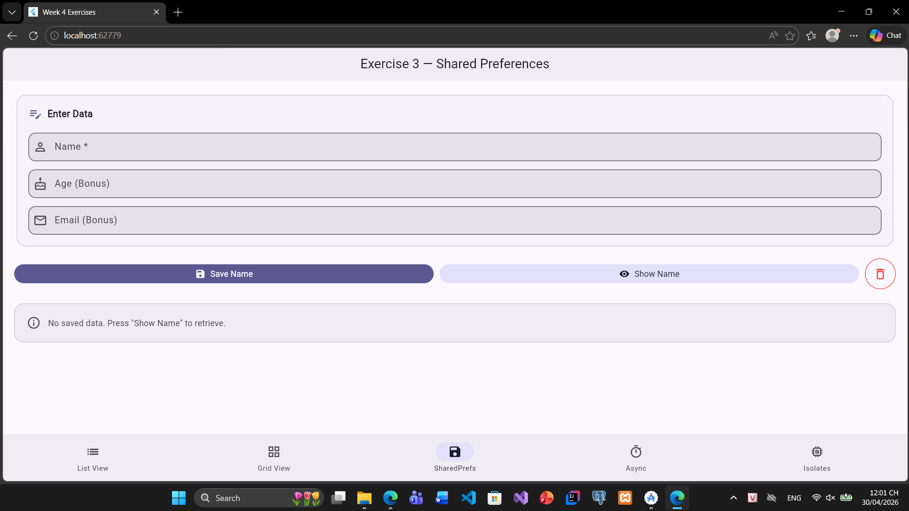 |  | 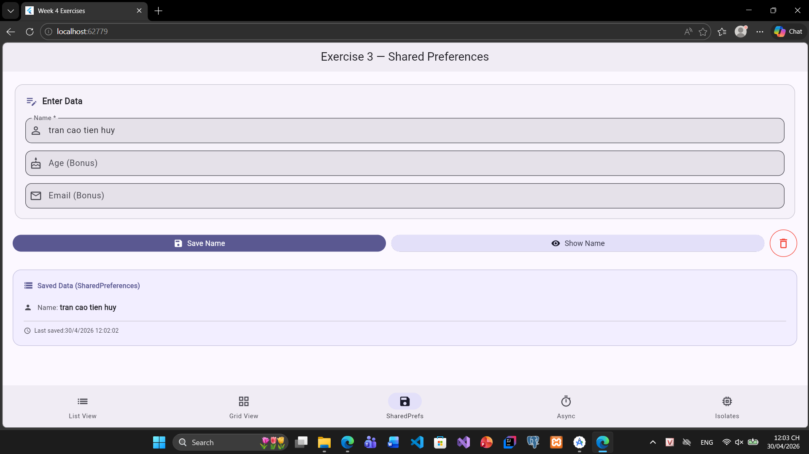 |
| *Trạng thái ban đầu — tất cả trường đều trống* | *Nhập tên và nhấn Save — toast xác nhận lưu thành công* | *Nhấn Show Name — giá trị đã lưu được đọc và hiển thị* |

**Bonus — Lưu Age & Email**

| Lưu Age + Email | Hiển thị toàn bộ dữ liệu |
|:---:|:---:|
| 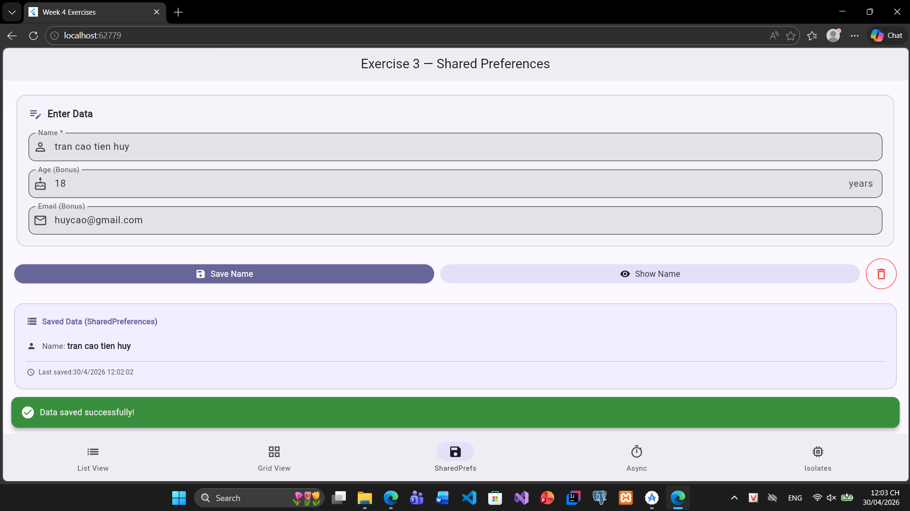 |  |
| *Nhập tuổi và email rồi nhấn Save — toast xác nhận thành công* | *Cả ba giá trị (tên, tuổi, email) được đọc và hiển thị cùng lúc* |

**Bonus — Xoá dữ liệu (3 bước)**

| Bước 1 — Có dữ liệu | Bước 2 — Đang xoá | Bước 3 — Đã xoá |
|:---:|:---:|:---:|
| 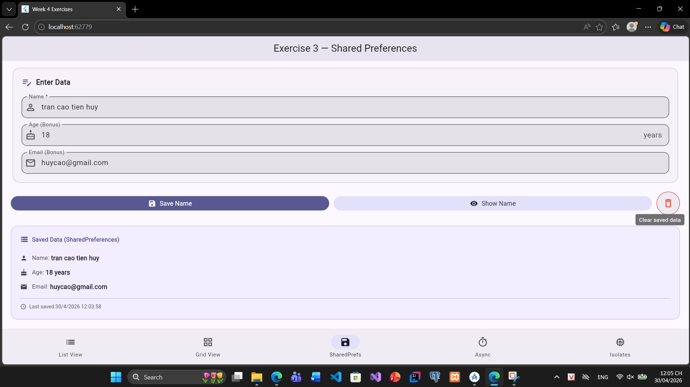 | 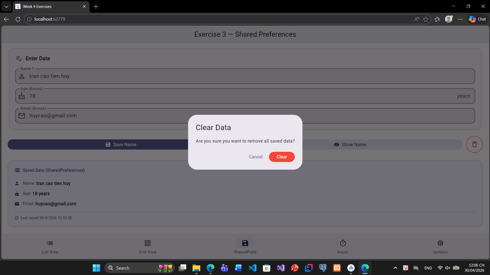 | 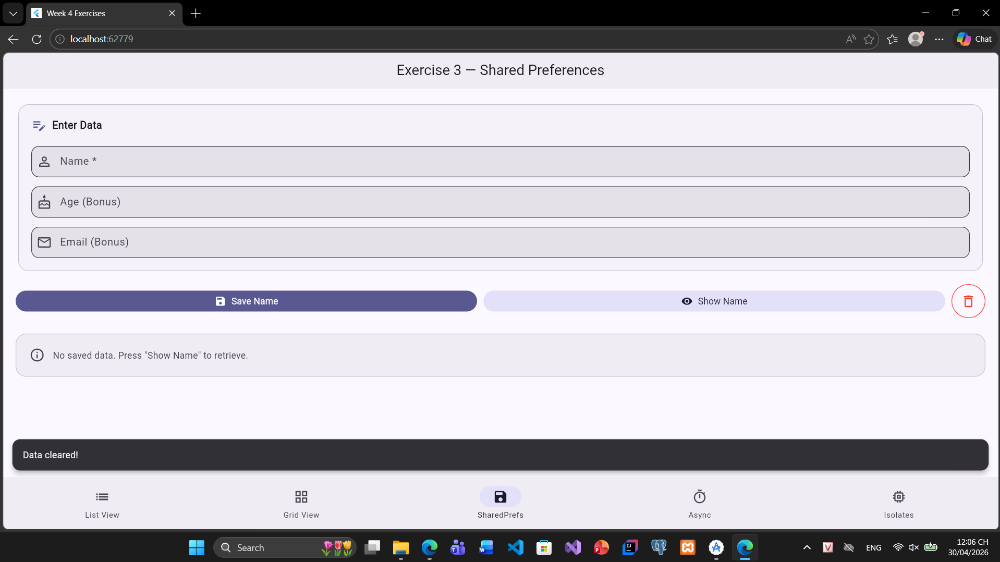 |
| *Dữ liệu đang hiển thị* | *Nhấn nút Clear* | *Tất cả trường về trống — SharedPreferences đã xoá sạch* |

---

## Bài 4 — Lập Trình Bất Đồng Bộ

Minh hoạ `async`/`await` kết hợp `Future.delayed` để mô phỏng một tác vụ bất đồng bộ (tương tự gọi API).

**Luồng thực hiện:**
1. Người dùng kích hoạt thao tác
2. UI hiển thị **"Loading user…"** kèm `CircularProgressIndicator`
3. Sau đúng **3 giây**, UI cập nhật thành **"User loaded successfully!"**

### Ảnh minh hoạ

| Màn hình ban đầu | Đang tải (Loading) | Tải xong (Success) |
|:---:|:---:|:---:|
| 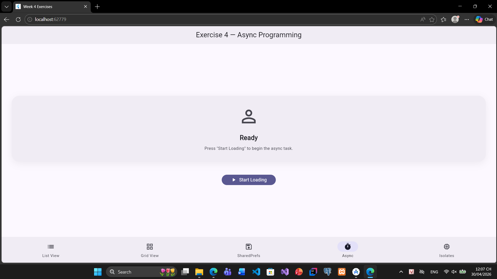 | 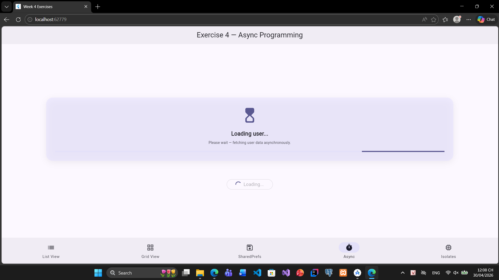 | 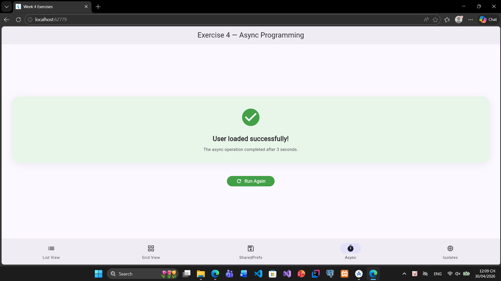 |
| *Màn hình trước khi bắt đầu thao tác bất đồng bộ* | *"Loading user…" + spinner — UI vẫn phản hồi trong lúc chờ* | *Sau 3 giây — "User loaded successfully!" xác nhận Future đã hoàn thành* |

---

## Bài 5 — Isolates

Hai challenge minh hoạ Dart Isolate để thực thi song song thực sự mà không chặn UI thread.

---

### Challenge 1 — Tính 30,000! trên Background Isolate

Tính giai thừa của **30,000** bằng hàm `compute()` của Flutter.

> **Tại sao không nhân trực tiếp?**
> 30,000! có đến **121.288 chữ số thập phân** — không thể lưu vào bộ nhớ dưới dạng số nguyên thông thường.
> Thay vào đó, thuật toán dùng **tổng logarithm**:
>
> ```
> log₁₀(n!) = log₁₀(1) + log₁₀(2) + … + log₁₀(n)
> ```
>
> Từ kết quả suy ra:
> - **Số chữ số** = `floor(logSum) + 1`
> - **Các chữ số đầu** = `10 ^ (phần thập phân của logSum)`
>
> 30.000 phép cộng số thực hoàn thành trong **< 10 ms** — hoàn toàn trong giới hạn 3 giây.

**Kết quả:** 121.288 chữ số · chữ số đầu `275953725… (×10^121287)` · thời gian ~0.002 s

### Ảnh minh hoạ

| Tính toán hoàn tất |
|:---:|
| 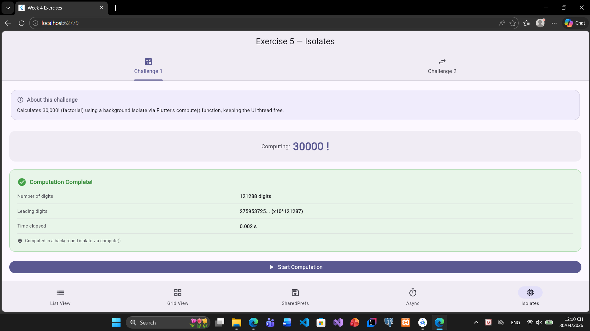 |
| *Hiển thị số chữ số, các chữ số đầu và thời gian thực thi — toàn bộ tính toán chạy trên background isolate qua `compute()`, UI không bị chặn* |

---

### Challenge 2 — Giao tiếp hai chiều giữa các Isolate

Tạo một worker isolate gửi số ngẫu nhiên mỗi giây; isolate chính cộng dồn và gửi lệnh dừng khi tổng vượt quá **100**.

**Luồng thực hiện:**
1. `Isolate.spawn()` tạo worker isolate
2. Worker gửi lại `SendPort` của nó để thiết lập kênh giao tiếp hai chiều
3. Worker gửi một số nguyên ngẫu nhiên (1–20) mỗi giây
4. Isolate chính cộng dồn và ghi log từng số nhận được
5. Khi `tổng > 100`, isolate chính gửi `"stop"` → worker gọi `Isolate.exit()` để thoát an toàn

### Ảnh minh hoạ

| Đang chạy (Running) | Đã dừng (Stopped) |
|:---:|:---:|
| 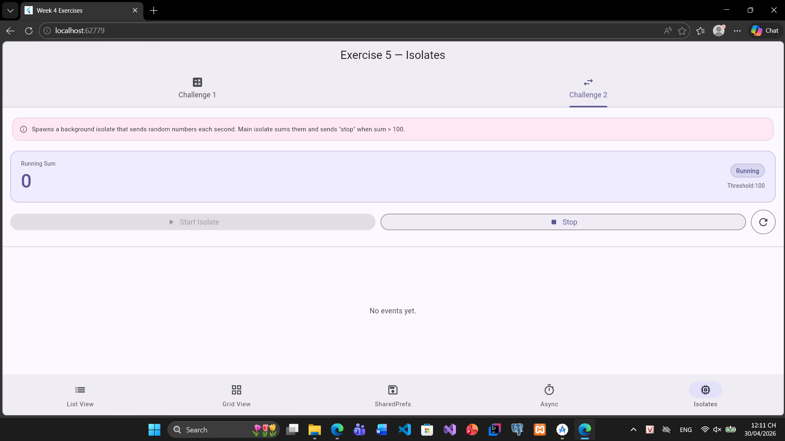 | 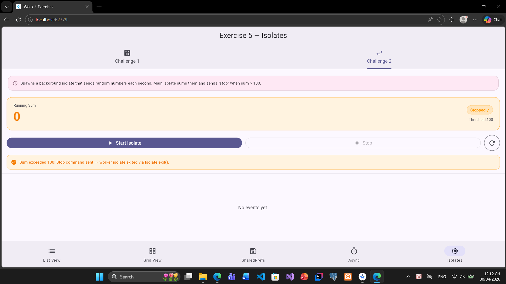 |
| *Worker đang hoạt động — badge "Running", tổng tăng dần, từng số nhận được ghi vào log* | *Tổng vượt 100 — lệnh stop gửi đi, worker thoát qua `Isolate.exit()`, banner xác nhận hiển thị* |

---

## Cấu Trúc Thư Mục

```
📦 lib
 ┣ 📂 models
 ┃ ┗ 📜 contact.dart                  # Model dữ liệu liên hệ
 ┣ 📂 screens
 ┃ ┣ 📜 list_view_screen.dart         # Bài 1 — ListView + Tìm kiếm + Chi tiết
 ┃ ┣ 📜 grid_view_screen.dart         # Bài 2 — GridView.count & GridView.extent
 ┃ ┣ 📜 shared_prefs_screen.dart      # Bài 3 — SharedPreferences CRUD + Bonus
 ┃ ┣ 📜 async_screen.dart             # Bài 4 — async/await + Future.delayed
 ┃ ┗ 📜 isolate_screen.dart           # Bài 5 — compute() & Isolate.spawn()
 ┣ 📂 screenshots                     # Ảnh minh hoạ cho từng bài tập
 ┗ 📜 main.dart                       # Điểm khởi chạy ứng dụng & điều hướng
```

---

## Tóm Tắt Kiến Thức Áp Dụng

| Kiến thức | Bài | API sử dụng |
|---|:---:|---|
| Danh sách cuộn với item tuỳ chỉnh | 1 | `ListView.builder` |
| Tìm kiếm / lọc theo thời gian thực | 1 | `setState` + `List.where` |
| Grid cột cố định | 2 | `GridView.count` |
| Grid cột linh hoạt theo màn hình | 2 | `GridView.extent` |
| Lưu trữ dữ liệu cục bộ | 3 | `SharedPreferences` |
| Lập trình bất đồng bộ | 4 | `async` / `await` / `Future.delayed` |
| Tính toán nặng trên background | 5 | `compute()` |
| Giao tiếp hai chiều giữa isolate | 5 | `Isolate.spawn` · `SendPort` · `ReceivePort` |
| Thoát isolate an toàn | 5 | `Isolate.exit()` |